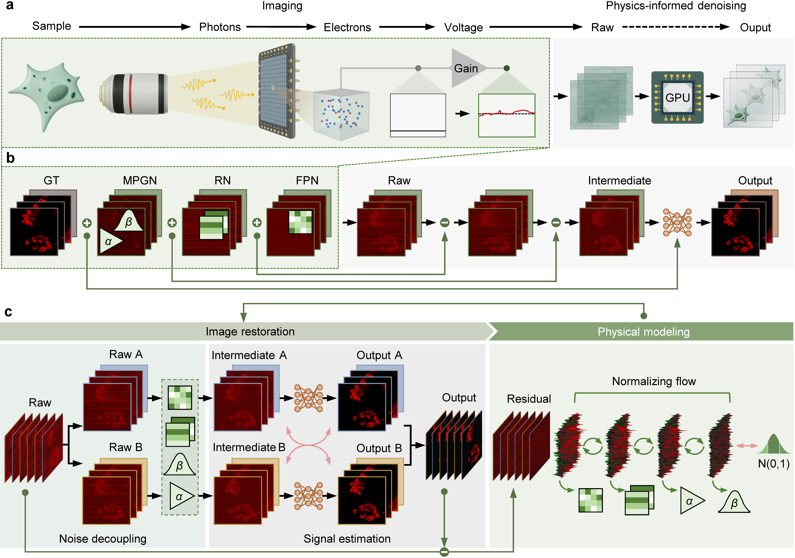

# DeepPhD 网页改造指导意见

状态：模板已完整，不再需要任何 UDMT 网页源码。下一步是按本文件做逐文件内容层替换（UDMT → DeepPhD），不是重做网站。

原则：

1. 所有原来属于 UDMT 项目的站内 / GitHub 链接，直接把 `UDMT` 替换成 `DeepPhD`。论文链接不这么处理。
2. 科学文案尽量从当前 manuscript / SI 原句抽取，不重新杜撰网页文案。
3. 图片 / 视频全部使用明确的本地占位符，并在 HTML 中标注素材应放到哪个路径。
4. CSS / SASS / Gemfile / LICENSE / 404 / atom / fonts 第一轮不动。

---

## 0. 结论：这不是重做网站

真正需要改的只有内容层少数文件。绝大多数 Jekyll / CSS 文件原样保留。

当前包里各文件状态：

| 文件 | 现状 |
| --- | --- |
| `_config.yml` | 已部分改成 DeepPhD（`title` / `url` 正确） |
| `index.html` | 只有标题改成 DeepPhD，其余基本还是 UDMT |
| `About.md` | 全部还是 UDMT |
| `Tutorial.md` | 全部还是 UDMT |
| `Datasets.md` | 全部还是 UDMT |
| `Gallery.md` | 全部还是 UDMT |
| `_layouts/default.html` | 导航和 GitHub 链接还是 UDMT |
| `README.md` | 还是 UDMT |

基本不用动：

- `_includes/head.html`
- `_layouts/page.html`
- `_layouts/post.html`
- `css/style.scss`
- 绝大多数 `_sass/`
- `fonts/`
- `Gemfile` / `Gemfile.lock`
- `404.html`
- `atom.xml`
- `LICENSE`

建议最终文件结构：

```
DeepPhD-page/
│
├── index.html                 ← 首页，重点重写
├── About.md                   ← 重写
├── Tutorial.md                ← 重写（先搭框架）
├── Datasets.md                ← 重写
├── Gallery.md                 ← 重写成 Supplementary Videos
│
├── _config.yml                ← 小改
├── _layouts/
│   └── default.html           ← 小改导航和 GitHub
│
├── images/
│   ├── deepphd_background.png
│   ├── deepphd_principle.png
│   ├── deepphd_physical_consistency.png
│   ├── deepphd_benchmark.png
│   └── deepphd_gui.png
│
└── videos/
    ├── teaser_lightsheet.mp4
    ├── teaser_miniscope.mp4
    └── teaser_twophoton.mp4
```

完整 Supplementary Video 1–5 倾向于 YouTube embed（像 DeepCAD / DeepCAD-RT）；首页三个 8–10 s teaser 才适合放本地 MP4。

SI 已把五个视频的科学定位定死，网页不重新发明故事：

- Video 1：synthetic HeLa benchmark
- Video 2：light-sheet zebrafish
- Video 3：freely behaving mice
- Video 4：dendritic spines
- Video 5：neutrophil migration

---

## 1. `_config.yml`（小改）

已正确：

```yaml
title:               DeepPhD
url:                 https://cabooster.github.io/DeepPhD
```

需要处理 author（这是 Jekyll theme 原始模板信息，不是 UDMT / DeepPhD）：

```diff
 author:
-  name:              BBNC
-  url:               nicoelayda.github.io
-  email:             nico@elayda.com
+  name:              DeepPhD
+  url:               https://github.com/cabooster/DeepPhD
+  email:
```

或者把整个 `author:` 删除。

---

## 2. `_layouts/default.html`（小改）

全站顶部导航结构完全保留，只改 logo 字母和底部 GitHub。

当前：

```html
<li class="hvr-underline-reveal"><a href="{{ site.baseurl }}/About/">About</a></li>
<li class="hvr-underline-reveal"><a href="{{ site.baseurl }}/Tutorial/">Tutorial</a></li>
<li class="logo"><a class="hvr-ripple-out" href="{{ site.baseurl }}/">U</a></li>
<li class="hvr-underline-reveal"><a href="{{ site.baseurl }}/Datasets/">Datasets</a></li>
<li class="hvr-underline-reveal"><a href="{{ site.baseurl }}/Gallery/">Gallery</a></li>
```

改动：

```diff
- <li class="logo"><a class="hvr-ripple-out" href="{{ site.baseurl }}/">U</a></li>
+ <li class="logo"><a class="hvr-ripple-out" href="{{ site.baseurl }}/">D</a></li>
```

底部：

```diff
- <a href="https://github.com/cabooster/UDMT">
+ <a href="https://github.com/cabooster/DeepPhD">
```

导航最终仍为：

`About | Tutorial | D | Datasets | Gallery`

暂时保留这个结构，符合 DeepCAD 系网页的朴素风格。

---

## 3. `index.html`（最大改动）

保留 Jekyll 头部和外层：

```html
---
layout: default
title: Home
---

<div class="page">
```

当前第 43–116 行视为全部删除，重新填 DeepPhD。

### 最终首页叙事（锁定）

```
DeepPhD
Physics-informed self-supervised denoising for fluorescence imaging

[首页 3 个 teaser]


1. Basic principle

为什么 fluorescence imaging 有 heterogeneous noise
为什么普通 self-supervised denoising 有 noise-assumption limitation
DeepPhD 核心思想

[Background / 或 Fig.1]


2. Physics-informed self-supervised denoising

[Fig. 1]

Explicit modeling of heterogeneous noise
↓
Learnable physical noise modeling
↓
Physics-informed noise decoupling
↓
Self-supervised joint optimization


3. Physical consistency and denoising performance

[Fig. 2 / Fig.1d–f]

parameter estimation
FPN / RN estimation
MPGN statistical consistency
benchmark

[Supplementary Video 1]


4. Applications and Results

Camera-based fluorescence imaging

  Light-sheet zebrafish
  [Supplementary Video 2]

  Freely behaving mice
  [Supplementary Video 3]


PMT-based multiphoton imaging

  Dendritic spines
  [Supplementary Video 4]

  Neutrophil migration
  [Supplementary Video 5]


5. Software and resources

GUI
Paper | Code | Tutorial | Data
```

首页结构跟着论文科学逻辑走：

physical noise decomposition → learnable physical modeling → noise decoupling → image restoration → joint optimization

再用 parameter / noise estimation 验证 physical consistency，最后扩展到不同 imaging modalities。

不要做成“有五个漂亮视频，所以列五个应用”的流水账。

首页三个 teaser 对应：

- `videos/teaser_lightsheet.mp4`
- `videos/teaser_miniscope.mp4`
- `videos/teaser_twophoton.mp4`

底部子页链接把 UDMT 换成 DeepPhD：

```html
<a href="https://cabooster.github.io/DeepPhD/About/">About</a> |
<a href="https://cabooster.github.io/DeepPhD/Tutorial/">Tutorial</a> |
<a href="https://cabooster.github.io/DeepPhD/Datasets/">Datasets</a> |
<a href="https://cabooster.github.io/DeepPhD/Gallery/">Gallery</a>
```

Paper 链接：

```html
<!-- REPLACE AFTER PAPER PUBLICATION -->
<a href="PAPER_URL_PLACEHOLDER">Paper</a>
```

Code 链接已确定：

```html
<a href="https://github.com/cabooster/DeepPhD">Code</a>
```

---

## 4. `About.md`（整篇重写）

保留 UDMT 页的大结构，换成 DeepPhD 内容：

```
Introduction

  Background
      fluorescence microscopy under photon-limited conditions
      ↓
      heterogeneous optoelectronic noise

  Limitations of existing self-supervised denoising
      ↓
      zero-mean / pixel-independence assumptions
      ↓
      lack of explicit noise modeling

  Physics-informed denoising
      ↓
      Why DeepPhD

Our Contribution

Results

Citation
```

About 页唯一建议新做的 PPT 图：

`images/deepphd_background.png`

它负责回答：**Why DeepPhD?**

论文 Fig. 1 回答：**How does DeepPhD work?**

两者不要混。

About 的绝大多数英文从 Introduction 直接抽原句，不重新发明表述。Introduction 已完整写出 shot noise、dark/readout noise、FPN、RN 的来源，以及 conventional self-supervised methods 的限制。

---

## 5. `Gallery.md`（全部重写为 Supplementary Videos）

删除 UDMT 的 6 个 tracking videos，换成：

1. Denoising performance on synthetic volumetric imaging data of HeLa cells — Supplementary Video 1
2. Ultrasensitive light-sheet imaging of GABAergic neurons in larval zebrafish — Supplementary Video 2
3. High-fidelity neural recording of freely behaving mice — Supplementary Video 3
4. Calcium transients of dendritic spines in the mouse cortex — Supplementary Video 4
5. Two-photon imaging of neutrophil migration after acute brain injury — Supplementary Video 5

标题直接采用 SI 正式标题。

形式：

```html
<h2>1. Denoising performance ...</h2>

<center>
<iframe
    width="1000"
    height="562"
    src="VIDEO_1_URL_PLACEHOLDER"
    title="YouTube video player"
    frameborder="0"
    allow="accelerometer; autoplay; clipboard-write; encrypted-media; gyroscope; picture-in-picture"
    allowfullscreen>
</iframe>
</center>

<hr>
```

一直到 Video 5。占位符：

```html
<!-- REPLACE WITH SUPPLEMENTARY VIDEO 1 YOUTUBE EMBED URL -->
<iframe src="VIDEO_1_URL_PLACEHOLDER"></iframe>
```

到：

```html
<!-- REPLACE WITH SUPPLEMENTARY VIDEO 5 YOUTUBE EMBED URL -->
<iframe src="VIDEO_5_URL_PLACEHOLDER"></iframe>
```

以后只需提供 Video 1–5 的 YouTube ID / embed URL。若最终不上传 YouTube、直接把 MP4 放 GitHub，只把这部分换成本地 `<video>`，科学内容不受影响。

---

## 6. `Datasets.md`（全部重写）

删除 UDMT 巨大的 animal-tracking dataset table。

DeepPhD 第一版做成很简单的：

**Data availability**

然后放 DeepPhD 自己的公开数据。当前正文已给出两个 Zenodo archive：

- behavioral recordings
- freely behaving mouse neuroethology source data

以及 **Code availability**。

第一版 Dataset 页不需要复杂表格。

特别提醒：

**不要直接保留 UDMT `Datasets.md` 中另外两个 Zenodo 链接。** 那是 UDMT 页面内容，DeepPhD 当前稿件的 Data availability 并没有写那两个 archive。网页以 DeepPhD 当前稿件为准。

---

## 7. `Tutorial.md`（先搭框架，之后结合代码仓完成）

这是唯一现在不能百分之百最终定稿的文件。

原因：论文只告诉 DeepPhD 的软件环境，没有告诉 repository 的实际安装命令和 GUI 操作步骤。

正文目前明确给了：

- Python 3.10
- PyTorch 2.8.0
- CUDA 12.9
- TorchVision 0.23.0
- Torchaudio 2.8.0
- NumPy 2.2.6
- …
- https://github.com/cabooster/DeepPhD

可以把 UDMT tutorial 全删掉，搭好 DeepPhD Tutorial 框架。

但诸如：

```
python xxx.py
deepphd --input xxx
python -m deepphd.gui.xxx
```

不要凭空编。

真正还缺：DeepPhD 代码仓的 README / installation instructions。不是为了首页，只是为了最后把 `Tutorial.md` 做准确。

代码仓整理好后，需要：

- README.md
- requirements.txt
- GUI 的启动方法

---

## 8. `README.md`（小改）

```diff
- # UDMT website
+ # DeepPhD website

- This website cabooster.github.io/UDMT/ is in continuous update.
+ This website https://cabooster.github.io/DeepPhD/ is in continuous update.
```

---

## 9. 链接处理规则

### 站内 / GitHub：字符串替换 UDMT → DeepPhD

```diff
- https://cabooster.github.io/UDMT/
+ https://cabooster.github.io/DeepPhD/

- https://cabooster.github.io/UDMT/About/
+ https://cabooster.github.io/DeepPhD/About/

- https://cabooster.github.io/UDMT/Tutorial/
+ https://cabooster.github.io/DeepPhD/Tutorial/

- https://cabooster.github.io/UDMT/Datasets/
+ https://cabooster.github.io/DeepPhD/Datasets/

- https://cabooster.github.io/UDMT/Gallery/
+ https://cabooster.github.io/DeepPhD/Gallery/

- https://github.com/cabooster/UDMT
+ https://github.com/cabooster/DeepPhD
```

### 论文链接：不字符串替换

UDMT 的 Nature Methods DOI 不能通过字符串替换得到 DeepPhD 论文链接。尚无正式 paper URL 时保留：

```html
<!-- REPLACE AFTER PAPER PUBLICATION -->
<a href="PAPER_URL_PLACEHOLDER">Paper</a>
```

以后只改这一处。

---

## 10. 素材占位符（锁定命名）

不再引用 UDMT 的：

`https://github.com/cabooster/UDMT/blob/page/images/...`

全部写成本地路径：

```html

```

或：

```html
<video ...>
  <source src="videos/xxx.mp4" type="video/mp4">
</video>
```

以后按相同文件名扔进对应文件夹即可，不需要再碰 HTML。

| 网页用途 | HTML 中的占位符 | 以后把素材传到 |
| --- | --- | --- |
| About 背景新图（Why DeepPhD?） | `images/deepphd_background.png` | `DeepPhD-page/images/deepphd_background.png` |
| DeepPhD 主原理图 | `images/deepphd_principle.png` | `DeepPhD-page/images/deepphd_principle.png` |
| physical consistency | `images/deepphd_physical_consistency.png` | `DeepPhD-page/images/deepphd_physical_consistency.png` |
| benchmark | `images/deepphd_benchmark.png` | `DeepPhD-page/images/deepphd_benchmark.png` |
| GUI | `images/deepphd_gui.png` | `DeepPhD-page/images/deepphd_gui.png` |
| 首页 light-sheet teaser | `videos/teaser_lightsheet.mp4` | `DeepPhD-page/videos/teaser_lightsheet.mp4` |
| 首页 mouse teaser | `videos/teaser_miniscope.mp4` | `DeepPhD-page/videos/teaser_miniscope.mp4` |
| 首页 two-photon teaser | `videos/teaser_twophoton.mp4` | `DeepPhD-page/videos/teaser_twophoton.mp4` |

### 正文 Fig. / Supplementary Fig. 怎么对应这些占位符

- `deepphd_principle.png`：优先来自正文 Fig. 1a–c（noise formation + noise decomposition + DeepPhD framework）。Fig. 1 本身已完整承担 “How DeepPhD works”。
- `deepphd_physical_consistency.png`：从现有内容重新裁一个网页组合图，核心使用 Fig. 1d–e + Fig. 2d–e，即：FPN / RN learned vs GT、MPGN statistical consistency、α / β estimated vs GT、FPN / RN estimation accuracy。用来证明 DeepPhD 的核心区别不是单纯 output 好看，而是物理噪声模型确实被正确学习。
- `deepphd_benchmark.png`：直接来自 Fig. 2a–c / Fig. 2f，或现有 Fig. 2 的网页裁剪版。
- `deepphd_background.png`：唯一建议重新做 PPT 的图，解释：

```
Heterogeneous fluorescence noise
             ↓
limitations of conventional
self-supervised denoising
             ↓
physics-informed DeepPhD
```

这一张不是论文 Fig. 1 的替代，而是 About 页的 **Why DeepPhD?**

如果后面需要网页专用 crop（目前不要求新画）：

- `physical_modeling.png`
- `noise_decoupling.png`
- `physical_consistency.png`

优先从已有 Figure 中裁。

### 有一个地方故意不留“素材占位符”

正文 / SI 已经有现成图的地方，不要求为网页重新画图。例如：

- Supplementary Fig. 1：Detailed workflow of DeepPhD
- Supplementary Fig. 2：RN estimation
- Supplementary Fig. 8：FPN learned pattern verification
- Supplementary Fig. 9：temporal projection verification

如果最后决定网页需要其中一张，只是从原始 Figure 文件导出 / 裁剪成网页 PNG，不是重新做 PPT。

### images/ 现状

现在 `images/` 里面基本全是 UDMT（`mice.gif`、`fish.gif`、`celegan.gif`、`drosophila.gif`、`udmt_schematic.png`、`udmt_result1.png`、`GUI-V3.png` 等）。这些最终都可以删。

**现在不要急着删。** 等 DeepPhD 网页能够正常跑起来，再一次性清掉。

---

## 11. favicon（后面换）

当前 `favicon.ico` / `favicon.png` / `apple-touch-icon.png` 全是 UDMT 那个蓝色 U。不影响网页功能，但最后一定要换。

可以暂时做成 `D`，或之后有 DeepPhD logo 再统一换。

---

## 12. CSS / SASS（第一轮不动）

`.container { max-width: 60rem; }` 大约对应 960 px 内容区，适合论文网页。标题、导航、字体、蓝色主题继续用。

现阶段基本全部不动：

- `_sass/base/*`
- `_sass/components/*`
- `_sass/pages/*`

唯一后面值得新增的是 responsive video / teaser grid（三个 teaser 电脑横排、手机竖排）。属于第二阶段，不影响现在填科学内容。

---

## 13. 代码里的三种标记

### ① 已确定，不需要操作

```html
<a href="https://github.com/cabooster/DeepPhD">Code</a>
```

### ② 等把图片放进去

```html
<!--
ASSET REQUIRED:
Export the DeepPhD principle figure and save it as:
images/deepphd_principle.png
-->

```

打开 HTML 就知道缺什么、应该放哪里。

### ③ 等最终外部链接

```html
<!-- REPLACE AFTER PAPER PUBLICATION -->
<a href="PAPER_URL_PLACEHOLDER">Paper</a>
```

或：

```html
<!-- REPLACE WITH SUPPLEMENTARY VIDEO 3 EMBED URL -->
<iframe src="VIDEO_3_URL_PLACEHOLDER"></iframe>
```

避免“现在先随便填个东西，之后忘了改”。

---

## 14. 当前真正的 diff 范围

| 文件 | 改动程度 |
| --- | --- |
| `_config.yml` | 小改 |
| `_layouts/default.html` | 小改 |
| `index.html` | 几乎全部重写 |
| `About.md` | 全部重写 |
| `Gallery.md` | 全部重写 |
| `Datasets.md` | 全部重写 |
| `Tutorial.md` | 先搭框架，之后结合代码仓完成 |
| `README.md` | 小改 |
| favicon | 后面换 |
| images | 后面替换（现在不删 UDMT 图） |
| CSS / SASS | 绝大多数不动 |
| Gemfile / fonts / LICENSE / 404 / atom | 不动 |

---

## 15. 现在不需要再提供的东西

- 任何 UDMT 网页源码文件（模板已经完整）

---

## 16. 以后需要补的两类材料（都不是现在立刻需要）

### 素材

- Fig. 1 / 2 导出的 PNG
- Supplementary Video 1–5 的 YouTube 地址
- GUI screenshot
- 以后做好的 background PPT

按第 10 节文件名放入 `images/` 和 `videos/`。

### Tutorial 信息

DeepPhD 实际代码仓的 README / 安装和运行命令。

---

## 17. 下一步

基于当前 ZIP 的真实源码，写一份逐文件 unified diff，覆盖：

- `_config.yml`
- `_layouts/default.html`
- `index.html`
- `About.md`
- `Gallery.md`
- `Datasets.md`
- `Tutorial.md`
- `README.md`

其中：

- 科学文案尽量从当前正文和 SI 原句抽取
- 图片 / 视频全部保留上述明确占位符，并注明最终应该把文件放到哪个路径
- CSS / SASS / Gemfile / LICENSE 第一轮不动

---

## 18. 最终科研素材与三层证据（2026-08-30 修订）

最小上线版（Fig.1 / Fig.2 + background + GUI）**不再**作为最终素材清单。最终网页必须突出：

physical formulation → learned physics is correct → real-data physical validation → restoration benefit → cross-detector generality → biological/quantitative utility

### 三层证据

1. **Principle**：`deepphd_background.png` + Fig. 1a–c（`deepphd_principle.png`）
2. **Physical validation**（最不能丢）：Fig. 1d–e → Fig. 2d–e → **Supplementary Fig. 8**
3. **Restoration + biological utility**：Fig. 2a–c,f + Video 1 → Videos 2–5 + Supp. Fig. 9 / 10

**Supplementary Fig. 8** 和 **Supplementary Fig. 10** 升为核心，不是补图。

- Supp. Fig. 8：真实 light-sheet 上，多帧平均保留的固定 FPN 与 DeepPhD estimated FPN 对应。
- Supp. Fig. 10：PMT 无 FPN/RN，模型自动减为 MPGN，仍优于比较方法。
- Supp. Fig. 9：temporal projection 验证 recovered weak structures，回应 hallucination 质疑。

完整文件名与优先级见 `ASSETS_REQUIRED.md`。已上传的完整 Fig. 2（`deepphd_evaluation.png`）只作裁剪源，首页不再整图使用。
